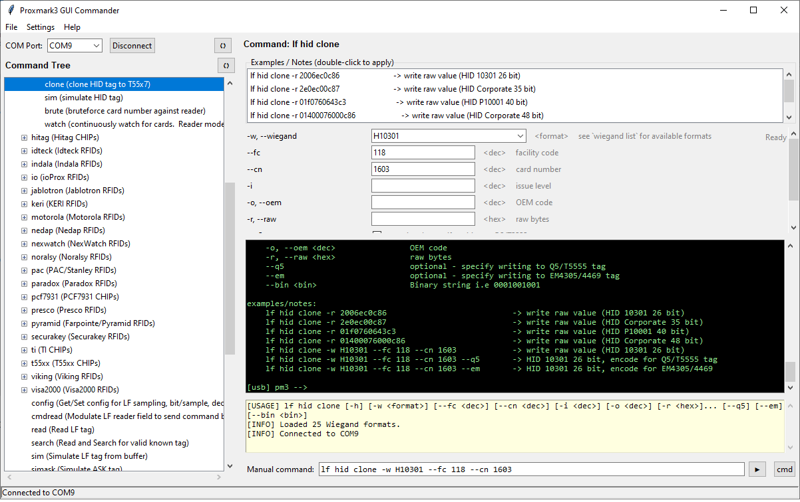

markdown
# Proxmark3 GUI Commander

A modern graphical interface for Proxmark3 on Windows.  
Forget the command line — all commands, options, examples, and formats are now in one window.


---

## 📸 Screenshots

**Command Tree & Options Panel**  


---

## 🚀 Features

- **Automatic command tree** – scans your Proxmark3, retrieves help for every section, and builds a hierarchical tree of all available commands.
- **Options panel with auto‑fill** – for each leaf command, checkboxes, text fields, and dropdowns are generated from the `Options:` section.
- **Wiegand format picker** – loads the complete list from `wiegand list` with a handy dropdown (name + description).
- **Usage examples** – double‑click an example to instantly fill all options.
- **Persistent options** – last‑used values are saved per command and automatically restored on next opening.
- **Real‑time log output** – all Proxmark3 output appears line‑by‑line in the black Session Log.
- **Separate status panel** – system messages (`[EXEC]`, errors, `[USAGE]`) are shown in a yellow area and don’t clutter the log.
- **"cmd" button** – opens a regular command prompt with `pm3.bat` running and automatically types the manual command (without executing it). The COM port is released before launch and automatically re‑acquired when you send commands from the GUI afterwards.
- **Automatic PTY restart** – if the pseudo‑terminal is stopped (e.g., after closing an external console), it restarts on the next command submission.
- **Tree caching** – after the first scan the tree is saved as JSON and loads instantly on subsequent launches.
- **All settings preserved** – Proxmark folder, COM port, encoding, and last command are restored automatically.
- **Batch execution mode** – every command runs as a separate `proxmark3.exe -c "command; exit"` process, avoiding port hangs and conflicts.
- **Configurable encoding** – choose UTF‑8, CP1251, CP866, etc., for correct Cyrillic display.

---

## 📥 Installation & Launch

### 1. Requirements

- **Windows** (tested on Windows 10/11).
- **Python 3.8 or newer** – download from [python.org](https://www.python.org/).
- **Proxmark3 client** – a working folder containing `client/proxmark3.exe`, `libs/`, and `pm3.bat`.  
  You can get an official build from:  
  [https://www.proxmarkbuilds.org/latest/rrg_other.php](https://www.proxmarkbuilds.org/latest/rrg_other.php)

### 2. Installation

Clone the repository or download the ZIP archive:

```bash
git clone https://github.com/senyasor-cell/WinProxGUI
cd WinProxGUI
Install the only external dependency – winpty (required for pseudo‑terminal support on Windows):

bash
pip install winpty
All other dependencies are part of the standard Python library (tkinter, subprocess, threading, json, re, etc.) – no extra installations needed.

3. Launch
bash
python pm3_gui.py
On first launch the program will ask you to select the Proxmark folder (Settings → Select Proxmark folder). After that, Wiegand formats, hardware version, and the command tree will load automatically.

🧭 How to Use
Select Proxmark folder – go to Settings → Select Proxmark folder… and point to the root directory that contains the client subfolder.

Choose COM port – the upper‑left combo box lists real system ports. Press 🔄 to refresh.

Load the tree – press 🔄 next to “Command Tree” or wait for automatic loading from cache.

Execute a command – double‑click a leaf command in the tree. The options panel appears. Configure the parameters and press ▶ (Send). The command runs and the output appears in the Session Log.

Manual input – type any command in the “Manual command” field and press ▶ or Enter.

Open console – the cmd button launches pm3.bat in a separate window and automatically types the manual command (without executing it). Just press Enter to run. After closing the console, the GUI automatically restarts the connection when you send the next command.

⚙️ Settings & Cache
All data is stored in your Windows home directory (C:\Users\<username>\):

File	Purpose
proxmark3_gui_config.json	Folder path, COM port, encoding, last command
proxmark3_gui_tree_cache.json	Cached command tree
proxmark3_gui_options.json	Saved option values for each command
To reset the settings, simply delete these files (the program will recreate them).

🔧 Troubleshooting
"proxmark3.exe not found"
→ Make sure the selected folder contains a client subfolder with proxmark3.exe.

"ERROR: invalid serial port COM9"
→ The port is busy or Proxmark3 is unresponsive. Close all other console windows with pm3 and try again.

Command tree is empty / options are blank
→ Press 🔄 next to “Command Tree” to force a full rebuild. Ensure that Proxmark3 is connected and recognised by the system.

Horizontal tree scrollbar is inactive
→ This is normal – it only appears when the command text exceeds the visible width. It activates automatically for long node descriptions.

"cmd" button does not start pm3.bat
→ Verify that pm3.bat exists in the chosen Proxmark root folder. The launch uses that folder as the working directory.

After closing external console, commands don't send
→ The GUI now automatically restarts the connection on the next command submission. If it still fails, check that the COM port is not locked by another process.

🏗 Project Structure
text
proxmark3-gui-commander/
├── pm3_gui.py               # main application file
├── screenshots/             # screenshots for README
├── README.md
└── .gitignore
🤝 Contributing
Pull requests are welcome! If you find a bug or have an idea for improvement, please open an issue.

📄 License
MIT License. See LICENSE for details.

🙏 Acknowledgments
The RfidResearchGroup team for the awesome Proxmark3 Iceman.

The Tkinter developers for making Python GUI creation simple.

All testers and contributors who helped polish this tool.

Proxmark3 GUI Commander – your personal assistant in the RFID world.
Try it and forget about the command line!