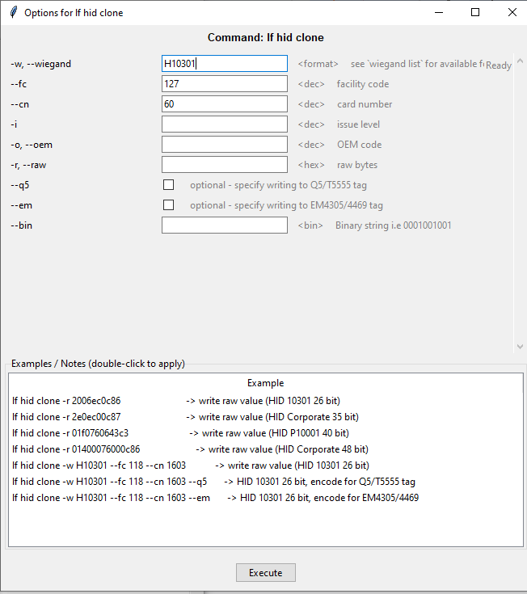

# WinProxGUI
Universal GUI for Proxmark3
# Proxmark3 GUI Commander

A modern graphical interface for the [Proxmark3 RFID instrument](https://github.com/RfidResearchGroup/proxmark3) on Windows.  
Build the command tree automatically, configure options with a rich dialog, and never type a long command again.

  

## Table of Contents

- [Features](#features)
- [Screenshots](#screenshots)
- [Installation](#installation)
- [Quick Start](#quick-start)
- [How It Works](#how-it-works)
- [Configuration & Caching](#configuration--caching)
- [Troubleshooting](#troubleshooting)
- [Contributing](#contributing)
- [License](#license)
- [Acknowledgments](#acknowledgments)

## Features

- **Automatic command tree** – scans your Proxmark3 client with `-h` and builds a hierarchical tree of all available commands.
- **Smart option dialog** – opens a dedicated window for each leaf command, with checkboxes, text fields, and format pickers.
- **Wiegand format chooser** – loads the full format list (`wiegand list`) automatically and lets you pick from a sortable table.
- **Example injection** – double‑click any usage example from the command’s help to fill all options instantly.
- **Persistent options** – last used options are saved per command and restored on the next opening.
- **Full command restore** – the last executed command (including all options) is restored on program restart.
- **COM port auto‑detection** – pick your Proxmark3 from a drop‑down list of available serial ports; refresh with a single click 🔄.
- **Auto‑close tree branches** – only one branch stays expanded at a time for a clean workspace.
- **Batch execution mode** – each command runs via `proxmark3.exe -c "command; exit"`, so there is no hanging terminal.
- **Session log** – all communication with the device is displayed in a color‑coded log panel.
- **Hardware info** – the Proxmark3 firmware, FPGA, and processor details are fetched automatically on connection.
- **Configurable** – choose output encoding (UTF‑8, CP1251, CP866, etc.) and save all preferences.
- **Cached tree** – the command tree is cached locally and reloaded instantly on next launch until you press *Build / Refresh Tree*.

## Screenshots

*Main window with tree, log, and manual command input*


*Option dialog for `lf hid clone` with format chooser*


*Wiegand format picker*


## Installation

### Prerequisites

- **Windows** (the GUI is built with `tkinter` and uses `wmic` for port detection).
- **Python 3.8 or newer** (the Proxmark3 client itself requires its own environment, but the GUI only needs a standard Python installation).
- A working **Proxmark3 client** – you need a folder that contains `client/proxmark3.exe` and the `libs` subfolder (i.e. the Iceman fork or any official build https://www.proxmarkbuilds.org/latest/rrg_other.php).

### Steps

1. **Clone the repository**
   ```bash
   git clone https://github.com/yourname/proxmark3-gui-commander.git
   cd proxmark3-gui-commander
Create a virtual environment (optional)

bash
python -m venv venv
venv\Scripts\activate
Install dependencies – the only requirement is tkinter, which is included with Python on Windows. No additional packages are needed.

Run the application

bash
python pm3_gui.py
Quick Start
Ensure your Proxmark3 is connected and appears as a COM port (e.g., COM9).

Launch the GUI.

Go to Settings → Select Proxmark folder… and choose the root directory that contains the client subfolder (e.g., D:\rrg_other-20210216).

The COM port drop‑down at the top left will list available ports. Select your Proxmark3’s port. Click 🔄 to refresh the list.

The application will automatically fetch hardware info and the Wiegand format list.

If a cached command tree exists, it will be loaded immediately. Otherwise, press Build / Refresh Tree to scan all commands.

Double‑click any leaf command in the tree to open its option dialog. Adjust the options and click Execute.

You can also type any command directly into the Manual command field and press Send.

Your last used command and options are saved and will reappear the next time you start the program.

How It Works
The GUI never keeps an open terminal session. Every command is sent to proxmark3.exe -p <COM> -c "command; exit". This avoids port conflicts and hung sessions.

The command tree is built by recursively asking for -h starting from the root. A line is recognised as a folder if it contains … in its description.

The option parser reads the options: section of each command’s help and creates appropriate widgets: booleans for flags, text entries for parameters with types (<dec>, <hex>, etc.), and a special format chooser for <format>.

All text is cleaned from ANSI escape codes and non‑printable characters.

Configuration & Caching
The application stores its data in your Windows user folder (C:\Users\<you>\):

File	Purpose
proxmark3_gui_config.json	Folder path, COM port, encoding, last path & full command.
proxmark3_gui_tree_cache.json	Cached command tree (specific to the Proxmark folder).
proxmark3_gui_options.json	Saved option values per command.
To reset everything, simply delete these files while the application is closed.

Troubleshooting
“COM port is busy” or “Timeout waiting for response”

Make sure no other application (including another instance of the GUI) is using the port.

Wait a few seconds and try again – the Proxmark3 can be slow to initialise.

“proxmark3.exe not found”

Ensure you selected the correct root folder. It must contain a client subfolder with proxmark3.exe.

Wiegand formats list is empty

Verify that your Proxmark3 is connected and that wiegand list works from a manual command prompt.

Refresh the COM port list or restart the GUI.

Qt platform plugin error

The GUI sets up the environment exactly as setup.bat does, including QT_PLUGIN_PATH. If you still see an error, try running the GUI from the same command prompt where you normally start pm3.bat.

Manual command not restored after restart

Check that last_full_command is present in proxmark3_gui_config.json. If the file was manually edited, ensure the JSON is valid.

Contributing
Pull requests are welcome! For major changes, please open an issue first to discuss what you would like to change.

License
This project is licensed under the MIT License – see the LICENSE file for details.

Acknowledgments
Proxmark3 Iceman fork – the powerful RFID tool this GUI was built for.

The Tkinter library – the standard Python GUI toolkit that made this project possible.
